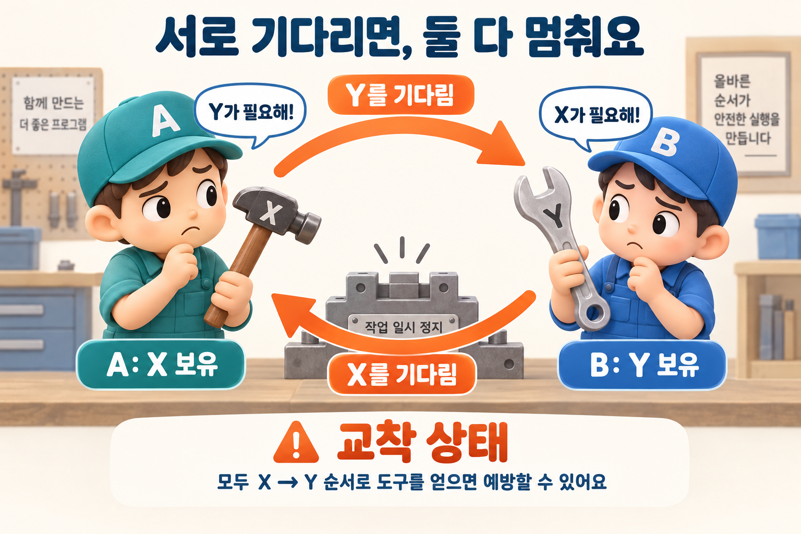

## 질문
스레드 A는 락 X를 가진 채 Y를 기다리고, 스레드 B는 락 Y를 가진 채 X를 기다립니다. 어떤 문제이며 어떻게 예방할 수 있나요?

## 정답
서로가 가진 자원의 해제를 기다리며 진행하지 못하는 교착 상태입니다. 두 락을 사용하는 모든 코드가 X 다음 Y처럼 동일한 전역 순서로 락을 획득하도록 만들면, 이 예시의 순환 대기를 예방할 수 있습니다.

## 해설
### 기다림이 원을 만들 때

A가 X를 놓으려면 Y를 얻어 작업을 끝내야 하고, B가 Y를 놓으려면 X를 얻어야 합니다. 두 스레드 모두 락을 유지하며 무기한 기다린다면 어느 쪽도 다음 단계로 진행할 수 없습니다. 실행 속도가 느린 상황과 달리, 단순히 더 오래 기다려도 해결되지 않습니다.

망치와 렌치는 두 락의 비유입니다. 각자 하나를 가진 상태에서 상대의 도구만 기다리므로, 어느 쪽도 두 도구가 필요한 작업을 끝낼 수 없습니다.

### 공통 순서를 정하기

두 계좌를 동시에 잠그는 송금 기능이라면, 모든 송금에서 계좌 ID가 작은 것부터 잠그는 규칙을 사용할 수 있습니다. 반대 방향 송금에도 같은 규칙을 적용해야 합니다. 이렇게 하면 한 스레드가 뒤쪽 락을 가진 채 앞쪽 락을 기다리는 순환을 끊을 수 있습니다.

### 타임아웃만으로 끝나지 않아요

일정 시간 뒤 획득을 포기하는 방법도 있지만, 실패 시 이미 잡은 락을 해제하고 중간 상태를 정리해야 합니다. 무작정 즉시 재시도하면 작업들이 서로 방해하며 계속 실패할 수도 있습니다. 순서 규칙은 일부 함수가 아니라 해당 락을 사용하는 모든 경로에서 지켜야 합니다.

### 참고 자료

- [Oracle Java Tutorials — Deadlock](https://docs.oracle.com/javase/tutorial/essential/concurrency/deadlock.html)
