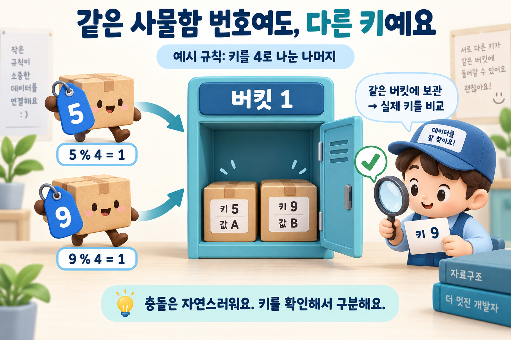

## 질문
서로 다른 키가 해시 테이블의 같은 버킷에 배정되면 어떻게 구분하며, 조회가 항상 O(1)인가요?

## 정답
같은 버킷에 배정되는 충돌은 체이닝이나 개방 주소법 등의 방법으로 처리하고, 최종적으로 키의 동등성을 비교해 원하는 항목을 찾습니다. 적절한 분산과 부하율 조건에서 평균적으로 빠른 조회를 기대하지만, 항상 O(1)이 보장되는 것은 아닙니다.

## 해설
### 위치를 찾은 뒤 키를 확인하기

설명용으로 버킷이 4개이고 `h(key) = key % 4`인 해시 함수를 생각해 봅시다. 키 5와 9는 모두 버킷 1로 갑니다. 이 예시에서 충돌을 연결 목록으로 처리한다면 같은 버킷에 두 항목을 보관하고, 조회 시 5인지 9인지 실제 키를 비교합니다. 단순 나머지 연산은 원리를 보이기 위한 예시입니다.

사물함은 버킷, 상자의 표시는 키와 값입니다. 같은 사물함에 두 항목을 함께 보관해도 실제 키를 비교하면 구별할 수 있습니다.

### 충돌 자체는 오류가 아니에요

버킷 수가 한정되어 있으므로 서로 다른 키가 같은 버킷으로 갈 수 있습니다. 같은 버킷에 도착했다는 이유만으로 같은 키라고 판단하면 안 됩니다. 값 갱신인지 새 항목 추가인지는 키 비교를 통해 결정합니다.

### 성능은 분산과 구현에 달려 있어요

원소 수에 비해 버킷 수가 작아지면 충돌이 늘 수 있습니다. 용량 확장과 재배치는 평균적인 성능을 유지하는 방법이지만 그 작업 자체에도 비용이 듭니다. 특정 버킷에 항목이 몰리면 단순 체이닝의 탐색은 길어질 수 있으며, 실제 라이브러리는 이를 줄이기 위한 별도 구조를 사용하기도 합니다.

### 참고 자료

- [Oracle Java — HashMap](https://docs.oracle.com/en/java/javase/21/docs/api/java.base/java/util/HashMap.html)
