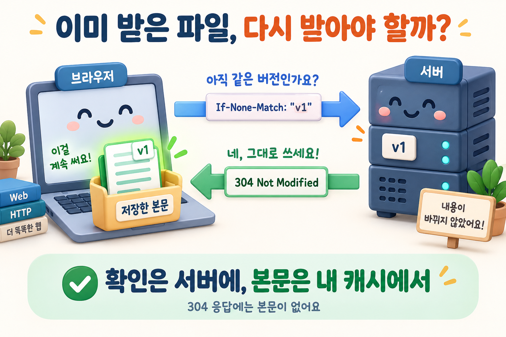

## 질문
브라우저가 저장한 HTTP 응답의 유효 시간이 지났을 때, ETag와 304 응답은 어떻게 본문 재전송을 줄이나요?

## 정답
브라우저는 저장한 ETag를 If-None-Match 조건에 넣어 서버에 재검증을 요청할 수 있습니다. 리소스가 바뀌지 않았다면 서버는 본문 없는 304 Not Modified로 응답하고, 브라우저는 저장한 본문을 재사용합니다. 바뀌었다면 새 본문이 담긴 200 응답 등을 받습니다.

## 해설
### 캐시 적중과 재검증은 달라요

아직 신선한 응답은 캐시 정책이 허용하면 네트워크 요청 없이 사용할 수 있습니다. 반면 오래된 응답의 재검증에는 서버와의 통신이 필요합니다. 304는 이때 본문을 다시 보내지 않아도 된다는 뜻이지, 서버에 전혀 요청하지 않았다는 뜻은 아닙니다.

작은 확인 요청과 응답만 오가고, 큰 문서는 브라우저의 보관함에 그대로 있습니다. 서버에 확인하는 통신과 본문을 다시 받는 동작을 구분해 보세요.

### no-cache와 no-store 구분하기

`Cache-Control: no-cache`는 응답을 저장할 수 있지만 재사용 전에 검증하도록 요구합니다. `no-store`는 해당 응답을 저장하지 않도록 지시합니다. 이름이 비슷해도 의미가 다릅니다.

### ETag는 비교를 위한 식별자

ETag는 서버가 특정 표현의 버전을 구별하기 위해 제공하는 값입니다. 반드시 파일 해시일 필요는 없습니다. 캐시는 요청과 응답의 정책, Vary 등의 조건도 함께 고려하므로 ETag만 같다고 모든 사용자에게 같은 본문을 보내면 안 됩니다.

### 참고 자료

- [MDN — HTTP caching](https://developer.mozilla.org/en-US/docs/Web/HTTP/Guides/Caching)
