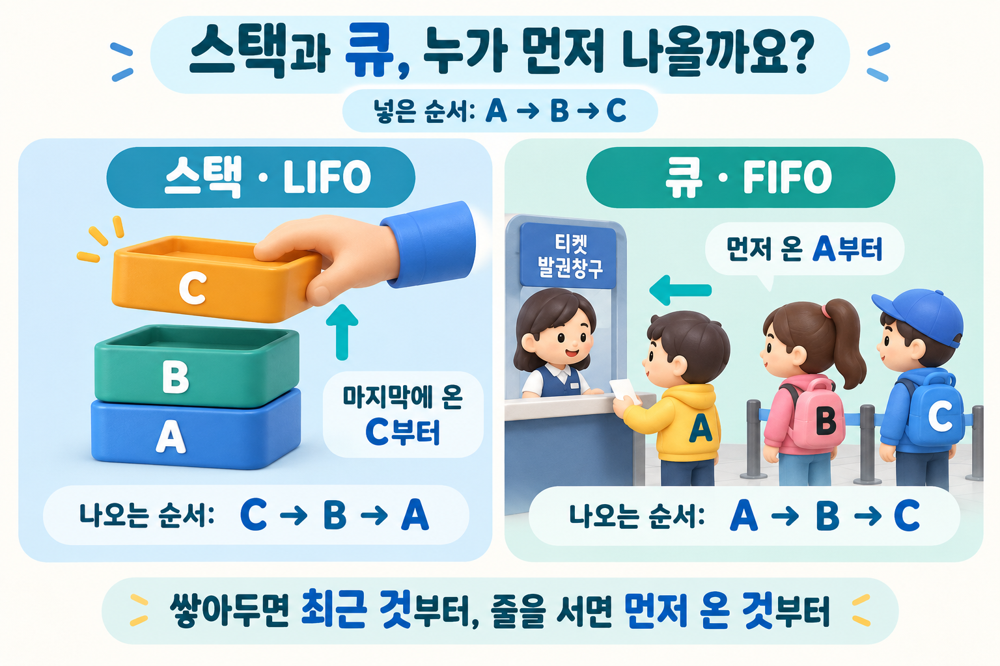

## 질문
A, B, C를 순서대로 넣은 스택과 FIFO 큐에서 원소를 모두 꺼내면 각각 어떤 순서가 되나요?

## 정답
스택은 마지막에 넣은 원소부터 꺼내는 LIFO 구조이므로 C, B, A 순서입니다. FIFO 큐는 먼저 넣은 원소부터 꺼내므로 A, B, C 순서입니다. 두 구조의 핵심 차이는 원소를 넣고 꺼내는 순서 규칙입니다.

## 해설
### 되돌리기와 대기열

문서 편집에서 가장 최근 작업부터 되돌리는 동작은 스택을 떠올리기 좋은 예입니다. 반면 도착한 요청을 접수 순서대로 꺼내 처리하려면 FIFO 큐가 어울립니다. 실제 시스템은 우선순위나 재시도 정책이 더해질 수 있으므로 모든 대기열이 단순 FIFO라고 가정하지는 마세요.

쌓인 상자는 스택, 표를 받기 위해 선 줄은 FIFO 큐의 비유입니다. 상자와 사람의 A·B·C 표시는 들어온 순서를 뜻합니다.

### 규칙과 구현은 구분해요

스택과 큐는 동작 규칙을 나타냅니다. 배열·연결 리스트 등으로 구현할 수 있고 구현에 따라 비용이 달라집니다. Python 리스트의 끝에서 추가·제거하면 스택처럼 사용할 수 있습니다. 앞쪽 원소를 반복 제거하는 큐를 만들 때는 리스트의 나머지 원소 이동 비용을 피할 수 있는 `collections.deque`가 적합합니다.

### 순서를 지킨다는 말의 범위

여러 작업자가 큐에서 요청을 순서대로 꺼내더라도 처리 시간이 다르면 완료 순서는 달라질 수 있습니다. **꺼내는 순서와 완료되는 순서는 별개**라는 점을 기억하세요.

### 참고 자료

- [Python Tutorial — Using Lists as Stacks and Queues](https://docs.python.org/3/tutorial/datastructures.html)
