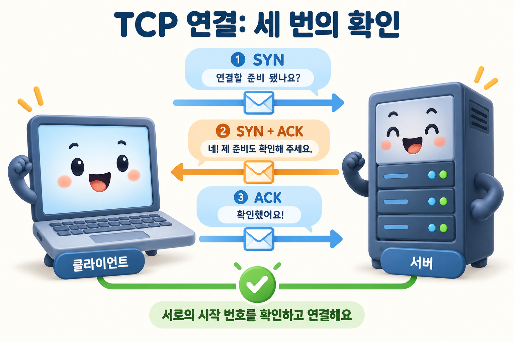

## 질문
일반적인 TCP 연결 시작 과정에서 SYN, SYN-ACK, ACK를 교환하는 이유는 무엇인가요?

## 정답
양쪽이 연결 상태를 만들고 서로의 초기 시퀀스 번호를 확인하기 위해서입니다. 클라이언트가 SYN으로 자신의 번호를 알리고, 서버가 SYN-ACK으로 이를 확인하면서 자신의 번호를 알리면, 클라이언트가 마지막 ACK로 서버의 번호를 확인합니다.

## 해설
### 두 방향의 시작점을 맞추기

클라이언트의 초기 시퀀스 번호를 100, 서버의 번호를 500이라고 가정해 보겠습니다. 클라이언트는 `SYN, seq=100`을 보냅니다. 서버는 `SYN+ACK, seq=500, ack=101`로 응답하고, 클라이언트는 `ACK, seq=101, ack=501`을 보냅니다. SYN은 시퀀스 번호 공간에서 1을 소비하므로 확인 번호가 1 커집니다.

그림의 대화는 연결 과정을 설명하는 비유이며 실제 TCP 메시지 본문은 아닙니다. 숫자 예시는 위 본문을 참고하세요. 데이터가 실리지 않은 일반적인 시작 예시이며, 실제 시퀀스 번호는 고정값이 아닙니다.

### 마지막 ACK의 역할

서버는 마지막 ACK를 받아 자신의 SYN도 상대에게 도착했다는 것을 확인합니다. 연결 시작 과정은 오래된 중복 세그먼트를 처리하는 데에도 중요합니다. 이후 데이터 전달은 시퀀스 번호·확인 응답·재전송 등의 절차로 관리합니다.

### TCP 연결과 암호화는 달라요

TCP 연결을 만들었다고 통신이 암호화되지는 않습니다. 예를 들어 TCP 위의 HTTPS에서는 TLS 절차가 추가됩니다. HTTP/3는 TCP 대신 QUIC을 사용하므로 이 그림을 그대로 적용하지 않습니다.

### 참고 자료

- [IETF RFC 9293 — TCP, Establishing a Connection](https://www.rfc-editor.org/rfc/rfc9293.html#section-3.5)
