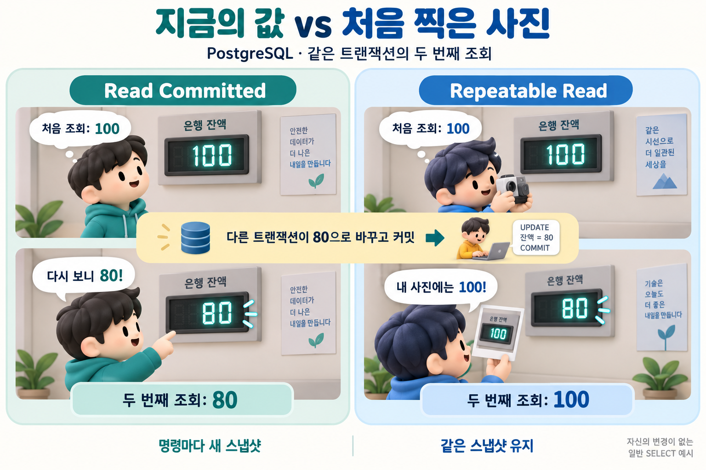

## 질문
PostgreSQL에서 같은 트랜잭션이 동일한 값을 두 번 조회할 때, Read Committed와 Repeatable Read는 어떤 차이가 있나요?

## 정답
Read Committed에서는 각 명령이 시작할 때의 스냅샷을 사용하므로 두 조회 사이에 다른 트랜잭션이 커밋한 변경이 두 번째 조회에 보일 수 있습니다. Repeatable Read에서는 첫 일반 명령 시점의 스냅샷을 유지하므로, 자신의 변경이 없는 일반 SELECT는 같은 기존 값을 봅니다.

## 해설
### 100을 읽고 다시 읽는 사이

A가 잔액 100을 조회한 뒤, B가 같은 행을 80으로 바꾸고 커밋했다고 해봅시다. A가 같은 트랜잭션에서 다시 일반 SELECT를 실행하면 Read Committed에서는 80을 볼 수 있습니다. Repeatable Read에서는 A의 기존 스냅샷에 따라 100을 봅니다. A 자체의 변경은 없다고 가정한 예시입니다.

처음 찍은 사진은 스냅샷의 비유입니다. 오른쪽도 실제 잔액은 80으로 변경되었지만, 조회하는 트랜잭션은 자신의 기존 스냅샷에 있는 100을 봅니다.

### 더 강한 격리가 모든 충돌을 없애지는 않아요

오래된 스냅샷을 사용한다고 동시 쓰기 충돌까지 사라지지는 않습니다. PostgreSQL의 Repeatable Read에서 다른 트랜잭션이 변경한 행을 수정하려 하면 직렬화 오류가 발생할 수 있어, 전체 트랜잭션 재시도가 필요할 수 있습니다. 여러 행에 걸친 업무 규칙에는 추가 제약이나 더 강한 격리 수준을 검토해야 합니다.

### 제품별 차이를 확인하세요

격리 수준의 이름이 같아도 구현과 구체적 보장은 DBMS별로 다를 수 있습니다. 이 질문의 답변은 **PostgreSQL의 일반 SELECT**를 기준으로 합니다. 잠금 조회와 쓰기 연산을 같은 방식으로 단정하지 마세요.

### 참고 자료

- [PostgreSQL — Transaction Isolation](https://www.postgresql.org/docs/current/transaction-iso.html)
